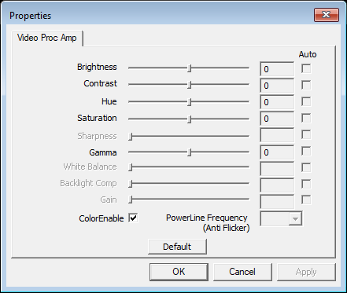
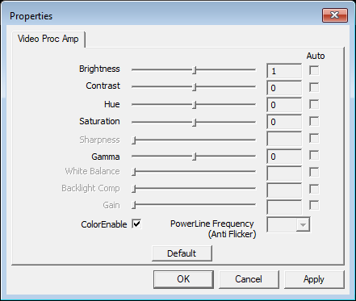

# Windows host test on zpc

The packaged headless host opened a real Windows DirectShow property dialog on zpc, with an emulated camera. The Configure dialog stayed responsive, accepted a brightness change, closed, and reopened. The host answered health requests throughout and exited 0. This resolves streammate-pivot#37 using the owner's requested webcam emulation. It does not certify physical camera drivers.

Captured on 2026-09-24 UTC, September 23 in the owner's Pacific timezone. zpc runs Windows 11 Home 10.0.26200. The probe ran as `ZPC\lloyd` in interactive desktop session 1 through an InteractiveToken scheduled task, at Limited run level. The host child used `CreateNoWindow=true` and had no Qt frontend. SSH itself runs in session 0, so starting the probe directly over SSH would not establish desktop-visible dialog behavior.

## Results

| Check | Observed result |
| --- | --- |
| Bundle integrity | All 614 files matched the CI sha256 manifest on zpc. |
| DirectShow camera | AkVirtualCamera 9.2.0, `AkVCamVideoDevice1`, named `StreamMate #37 emulated camera`. |
| Source capture | `dshow_input` reported 640×480 after selecting the device. This is emulated output, not physical video. |
| Form | Device list, 640×480 and 1280×720 resolutions. Custom mode at 640×480 returned 30 FPS, interval 333333 in 100 ns units, and YUY2 alongside Any. |
| Configure | Two successful native `Properties` windows with a `Video Proc Amp` page. |
| Interaction | Window moved from x52/y52 to x132/y112. A right-arrow message to the enabled brightness trackbar changed its position from 255 to 256 and the displayed value from 0 to 1. Cancel closed it. The second opening showed brightness 0. |
| Host responsiveness | Six explicit `host.health` responses were ready across the dialog sequence, including while open and after each close. |
| Threads | All three protocol presses ran on main thread 7980. Both Configure windows belonged to thread 11232. |
| Crossbar | Protocol press accepted; no host-owned window appeared during the following observation, about 7 seconds later. The emulator has no crossbar implementation. This proves the no-dialog behavior, not a successful crossbar dialog. |
| Shutdown | Dialog campaign and separate custom-form campaign both exited 0. |
| Cleanup | Emulator uninstalled; no test camera registrations, test processes, or scheduled tasks remained. Bundle and evidence files remain in `C:\Users\lloyd\streammate-pivot-37`. |

`callbackReturned=false` in the prototype response is the boolean returned by `obs_property_button_clicked`, not a failure to invoke the callback. OBS's VideoConfigClicked and CrossbarConfigClicked enqueue their actions and return false, meaning no property refresh is requested.

## Visual proof

First opening:

After moving the window and changing brightness:

Second opening after Cancel:

These are `PrintWindow` captures of the actual host-owned native window. They are not mockups, and do not include the rest of the owner's desktop. Window handles, bounds, child controls, and owning thread IDs are retained in [emulated-dialog.log](emulated-dialog.log).

## Thread and message loop conclusion

The runtime window thread differs from the protocol/main thread. This matches the pinned OBS implementation: [DShowThread](https://github.com/obsproject/obs-studio/blob/32.1.2/plugins/win-dshow/win-dshow.cpp) calls `CoInitialize`, processes queued ConfigVideo/ConfigCrossbar actions, and pumps messages with `MsgWaitForMultipleObjects`. libdshowcapture calls `OleCreatePropertyFrame` on that thread. The host did not add a Qt event loop or a separate UI thread for this test. It did need to run in the logged-in user's interactive desktop session.

## Provenance and retained evidence

- Host commit `8fce0a5da31d33d4949604eff1249e3a95b2dbc1`, branch `prototype/windows-host`. The executable and DLLs were not changed for this test.
- [Successful CI run 35946052820](https://github.com/bidaidev-creator/streammate-studio-host/actions/runs/35946052820), artifact `streammate-studio-host-windows-x64`, artifact ID 10786512972.
- Archive SHA256 `5b8e4dd29659ad885b75dfbec0c4a0d9d960e7681ce45aa4b2a012d7b92b3980`. [hash-verification.json](hash-verification.json) records the on-machine verification.
- Emulator from the [official AkVirtualCamera 9.2.0 release](https://github.com/webcamoid/akvirtualcamera/releases/tag/9.2.0). Installer and installed DLL digests are in `emulator-9.2.0-install.json` and `emulated-machine.json`. Installer binaries are not redistributed here.
- [result-summary.json](result-summary.json) records the verdict and full custom form. [custom-form.log](custom-form.log) preserves that separate run's requests and responses.
- `no-camera-baseline.log` records the initial successful Windows run before installing an emulator.
- `automated-probe.ps1` derives from the bundled probe. It adds a numbered file command queue, native-window observation, and a `custom` command. `ui-helper.ps1` contains the window observation/control code. `commands.json` records the exact successful dialog sequence. The `run-*.ps1` scripts record how the scheduled tasks invoked it.
- `cleanup.json` records the final machine cleanup. JSON files were normalized to UTF-8; raw probe logs and PNGs retain their captured bytes. `SHA256SUMS` covers this evidence directory apart from the checksum file itself.

## Emulator failure retained

AkVirtualCamera 9.4.1 failed registration through its manager and through regsvr32. A direct registration probe returned HRESULT `8000FFFF`. Calling registration on an MTA thread installed its camera entry, but subsequent host camera enumeration crashed twice with exit `-1073741819`, access violation `0xc0000005`. Windows Error Reporting identified `combase.dll` as the faulting module.

The failed probe logs and `emulator-9.4.1-crashes.json` are retained. Switching to 9.2.0 allowed the same packaged host to complete the tests. This is an observed emulator-version compatibility difference; no stack trace established a root cause. Do not claim arbitrary camera-driver compatibility from the passing run. The temporary `serviceTimeout=0` emulator setting skipped its service startup wait and was removed at cleanup. No frame feeder was used; the camera supplied its fallback output.

## Repeat the test

Use `ssh lloyd@zpc` with this Mac's existing `~/.ssh/id_ed25519`. The original streammate access note is `~/.claude/projects/-Users-Chibi-Agent-Projects-streammate/memory/zpc-windows-box-ssh-access.md`. Check that zpc's GitHub runner is idle before testing. Do not copy GitHub credentials to zpc.

Download the pinned host artifact on the Mac, transfer it, extract it, and verify every manifest entry. Install AkVirtualCamera 9.2.0 temporarily, add one named test device using its x64 manager, add YUY2 640 480 30 and RGB24 1280 720 30 formats, then run `update`. Use the device ID returned by `add-device`; it need not be Device1 on another machine. Run the bundled interactive probe from the logged-in desktop, or use the retained automated probe through an InteractiveToken task. Feed the numbered command files in order, waiting for the dialog to appear before observation and for closure before reopening. Run the custom-form sequence separately. Close the host, remove the test camera, uninstall the emulator, and delete the temporary scheduled tasks.

Physical USB-camera behavior and a crossbar-capable capture device remain untested. Crossbar should use the settings renderer's disabled native-action fallback with an explanation when unavailable; this throwaway prototype still exposes the button. SmartScreen and Defender shell prompts were not tested by these scheduled-task launches. Windows distribution research remains the [separate report](https://github.com/bidaidev-creator/streammate-pivot/blob/research/windows-distribution/docs/research-windows-distribution-2026-09-23.md).
